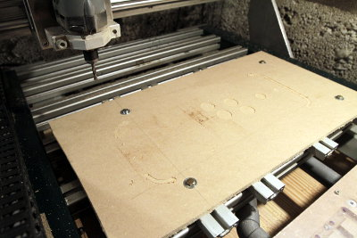
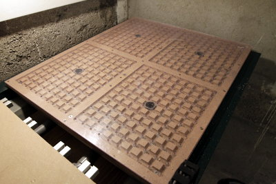
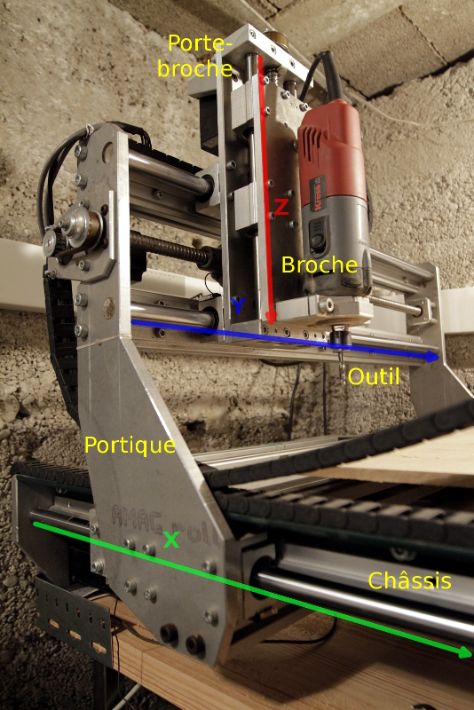
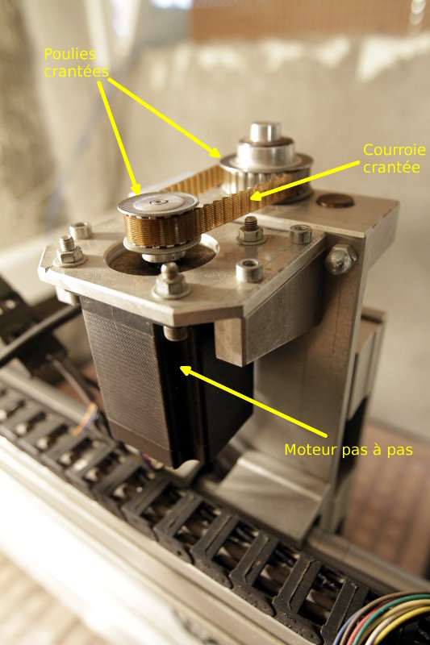
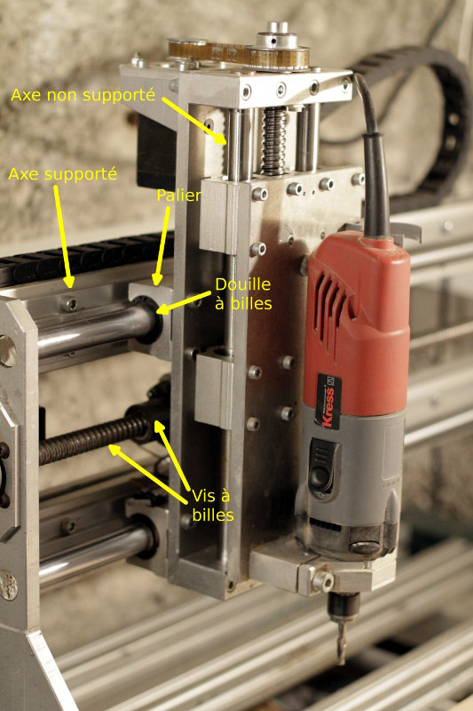
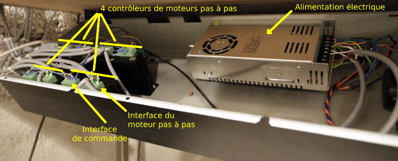
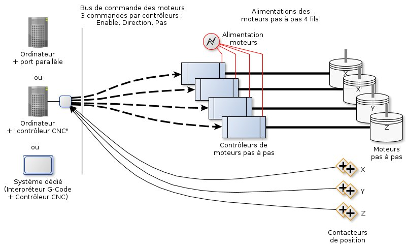
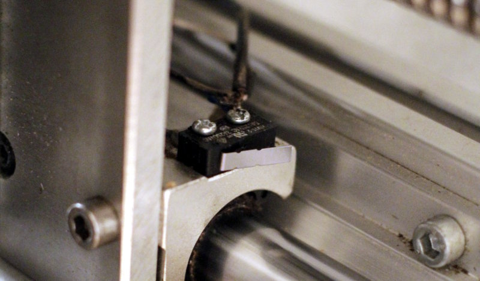

# Les bases du fonctionnement d'une CNC

## Un peu d'histoire pour mieux comprendre

L'histoire de la machine-outil à commande numérique n'est pas récente, on
trouve la première *machine-outil* en 1751 ([Jacques de Vaucanson](https://fr.wikipedia.org/wiki/Vaucanson) invente le tour à charioter), les premières *machines-outils automatisées* (par cames) au XIXème siècle et c'est vraisemblablement en 1942 que l'histoire de la *machine-outil à commande numérique* débute, grâce à [John T. Parsons](https://en.wikipedia.org/wiki/John_T._Parsons).

La programmation se faisait avec des cartes perforées, tout d'abord pour les
calculs et quelques années plus tard - lorsque les servomoteurs ont été mis au point - pour le contrôle. Cependant, les coûts et les usages réservent de
telles machines à l'industrie de pointe, à l'armement, etc et ne sortent que
rarement des laboratoires de recherche.

La technologie va continuer de se perfectionner mais aussi devenir plus
abordable et va rejoindre les bureaux d'études et les chaînes de production de produits destinés au grand public. À tel point que depuis deux ou trois
décennies cette technologie devient accessible aux petites entreprises et aux
passionnés avertis ; demain elle arrivera peut-être dans le grand public sous
la forme d'une imprimante 3D, qui sait ?

## Définition

Une CNC *(Computer Numerical Control)* ou MOCN *(Machine-Outil à Commande
Numérique)* est donc tout d'abord une machine-outil : elle permet selon ses
caractéristiques d'effectuer diverses opérations - percer, scier, rectifier,
découper, fraiser, plier, graver, tarauder, souder, visser, déposer un
matériau, etc - nécessitant des gestes précis et/ou répétitifs, sur des
matériaux divers. Dans le cas d'une CNC, ces opérations seront donc commandées par un ordinateur ou un dispositif numérique.

> Sous la dénomination "CNC" se retrouvent de nombreux dispositifs qui diffèrent entre eux principalement par l'outil qui est utilisé. Je présenterai ici le principe d'une CNC permettant d'usiner par retrait de matière à l'aide de fraises, forets, etc. Cette CNC a été imaginée et construite par un particulier à qui nous l'avons achetée récemment. Enfin, ma connaissance du domaine est très récente et surtout autodidacte ; je n'ai jamais suivi de formation et n'ai aucun diplôme de technicien d'usinage ou autre.

## Possibilités

Les matériaux qui peuvent être usinés sont très divers, la caractéristique principale qui les différencie est la dureté. Plus le matériau est dur, plus il faudra que la CNC, ainsi que l'outil qui l'équipe aient la qualité et la puissance nécessaires pour usiner le matériau. Cependant pour commencer à usiner sans forcément aller rapidement, c'est principalement l'outil et la vitesse de rotation de celui-ci qui vont influer.

Voici une liste non exhaustive de matériaux que l'on peut usiner :

- acier
- aluminium
- laiton
- polycarbonate
- bois massif
- contreplaqué
- résine
- [mdf](https://fr.wikipedia.org/wiki/Panneau_de_fibres_%C3%A0_densit%C3%A9_moyenne)
- mousse

Dans certains cas, l'usinage requiert de l'huile de coupe, de l'air sous pression, ou autre. Le but recherché est de refroidir le matériau et l'outil, mais également de lubrifier pour réduire les frottements et l'usure prématurée.
L'air comprimé est plus adapté lors de la découpe du polycarbonate par exemple pour éviter que le matériau fonde et vienne se recoller sur l'outil ou le matériau. Attention à ne pas utiliser n'importe quel produit, pensez d'abord à votre sécurité et à votre santé. Dans tous les cas, avec ou sans huile de coupe, le port d'un masque, de lunettes de protection et de bouchons d'oreille est obligatoire si la CNC n'a pas d'équipement vous protégeant des nuisances (projections de copeaux, de fluide de coupe, fumées, casse, bruit, etc).

En dehors de l'industrie, les domaines d'utilisation d'une CNC sont nombreux, voici quelques exemples : Le modélisme (ailes et panneaux d'avions, châssis de voiture, éléments de bâtiments), l'électronique (circuits imprimés, boîtier pour montages), la réparation (poignées, butées, guides, engrenages), la décoration, l'ébénisterie, la lutherie, la mécanique, etc.

L'imagination, l’expérimentation et la recherche de chacun amèneront leur part de nouveauté dans ce domaine.

## Structure

Observons techniquement de quoi est composée une CNC, en partant de la table qui accueillera le matériau à usiner. La base est similaire à ce qu'on aurait dans le cas d'un usinage manuel : le matériau doit être solidement [fixé](http://fr.wikipedia.org/wiki/Mise_en_position_et_maintien_d%27une_pi%C3%A8ce#Liaison_pi.C3.A8ce-machine_pour_un_usinage) à une table d'usinage à l'aide d'un étau, de butées, de pinces, ou collée, etc, selon les besoins. On parle de bridage, de serrage, etc. Parfois la table d'usinage peut-être une table aspirante ou un "martyr".

|  |  |
|:-----------------------------------:|:--------------------------------------:|
|   Table d'usinage *"martyr"*        |    Table aspirante                     |

L'usinage du matériau peut se faire avec un outil (une fraise, un foret, une
lame, une pointe à graver, etc) dont les caractéristiques sont adaptées au matériau et à l'opération à réaliser ; il n'est pas rare que cet outil soit conçu et réalisé spécialement pour effectuer l'opération voulue. Cet outil est monté sur ce qu'on appelle une broche, c'est-à-dire, l'ensemble formé par le système de fixation de l'outil et le moteur permettant la rotation à l'origine de l'usinage.

Tout cela est très proche de ce qui est mis en place lors d'une opération manuelle. Maintenant voyons comment l'action de l'homme a été remplacée par la commande d'une machine :

Si on usine avec un outil en position verticale, 3 axes (X, Y et Z) suffisent pour le déplacer dans l'espace. Et pour se repérer dans cet espace orthonormé, on utilisera l'unité de mesure du système international (le mètre) ou celle du système anglo-saxon (le pouce).

De nombreuses CNC ont pour base un châssis rigide sur lequel les différents organes de la machine reposent pour opérer. Essentiellement deux catégories de structures existent : la *table mobile* et le *portique mobile*. Dans le premier cas, le portique est fixé sur le châssis en son centre et c'est la table d'usinage qui se déplace sur un axe (X). Dans le deuxième cas, plus courant, c'est l'inverse : la table est fixée au châssis et le portique se déplace sur l'axe (X) pour parcourir la table d'usinage. Ce dispositif est moins coûteux en espace et se révèle plus versatile, c'est le cas de notre CNC.

    La table d'usinage (ici un martyr) est fixée au châssis.
    Le portique est mobile sur toute la longueur du châssis.

Le portique quant à lui sert de base pour le déplacement sur l'axe Y du porte broche.
Le porte broche enfin sert de base pour le déplacement sur l'axe Z de la broche.

    L'ensemble des axes X, Y et Z permet de déplacer l'outil de coupe positionné verticalement.

Dans certaines situations, il est pratique d'avoir un quatrième, cinquième ou énième axe pour orienter l'outil et/ou orienter le matériau ; ainsi des opérations peuvent s'appliquer sur des faces du matériau non accessibles sur une CNC 3 axes.

## Mécanique

La liberté de mouvement est donc gérée par ces axes mais il faut encore assurer le déplacement avec force et précision ; ceci est possible grâce à de nombreuses solutions mais je vais expliquer ici la plus populaire : les moteurs pas à pas, les vis à billes et les axes supportés.

Le moteur pas à pas est un moteur dont le fonctionnement est relativement fiable, puissant, précis mais pas très rapide. Lorsque les moyens le permettent, des servomoteurs pas à pas sont utilisés, permettant d'avoir une correction en cas d'erreur - le servomécanisme permettant l'asservissement et la rétroaction (on donne une commande et on vérifie qu'elle se réalise). Un ou parfois plusieurs moteurs pas à pas peuvent être utilisés pour mouvoir chaque axe.

    Le moteur pas à pas de l'axe Z, couplé indirectement à la vis à billes

La vis à billes permet de convertir la rotation du moteur en translation (comme lorsqu'on visse une vis !). Les billes remplacent les pas de l'écrou, limitant ainsi les frottements et augmentant considérablement la précision. Le couplage entre le moteur et la vis à billes peut être :

- direct, au moyen d'un *coupleur d'axe* spécifique qui protégera de la casse le moteur et la vis,
- ou indirect, au moyen de poulies et de courroies qui permettront une démultiplication de l'effort tout en gardant une certaine souplesse de mouvement.

Pour finir, un *axe supporté* est un axe rond en acier trempé monté sur un
support en aluminium permettant ainsi de fixer et soutenir l'axe sur toute sa
longueur. Ces axes sont donc très utiles pour des axes longs qui pourraient
fléchir s'il n'étaient pas supportés. La partie mobile glisse sur l'axe grâce à
des *paliers* montés sur des *douilles à billes*. On conserve ainsi une grande
stabilité lors du déplacement.

    Un peu de mécanique ...

D'autres solutions existent :

- les vis trapézoïdales (meilleures que le pas de vis classique) et les axes
  non supportés sont bon marché mais sont plus sensibles à l'usure et sont
  moins précis que la solution vis à billes et axes supportés.

- les rails guidés à billes sont coûteux mais remplacent avantageusement les
  axes supportés et douilles à billes, offrant encore plus de précision et de
  stabilité.

- les vis à rouleaux satellites offrent également un niveau supérieur de
  puissance, de durabilité et de précision par rapport aux vis à billes. On les
  trouve sur des machines dont les conditions de mise en œuvre sont soumises à
  de fortes contraintes ce qui explique leur coût élevé.

## Les moteurs pas à pas et les contrôleurs

Pour comprendre le pilotage d'une CNC, il faut d'abord connaître un peu le fonctionnement d'un moteur pas à pas :

Un moteur pas à pas est conçu pour effectuer un tour complet en un certain nombre de pas. Cette caractéristique est indiquée sur le moteur sous la forme ***1,8°/step*** ou ***200 steps/rotation***. Le pas correspond donc à l'unité de mouvement du moteur. Cette rotation peut se faire dans le sens des aiguilles d'une montre ou inversement.

Le moteur pas à pas est généralement alimenté sur 4 fils, reliés deux à deux à des bobines. C'est en alimentant ces bobines et en tenant compte de la polarité d'alimentation, que le moteur tournera d'un pas dans un sens ou dans l'autre ; en alternant cette alimentation dans un ordre précis, on fait faire plusieurs pas au moteur. Sans rentrer dans le détail du fonctionnement, cela signifie qu'il faut être capable d'alimenter le moteur avec un courant de forte intensité en alternant très rapidement les bobines et les polarités, tout en conservant une qualité d'alimentation. Pour cela, on peut utiliser un *contrôleur de moteur*, sur lequel on branche directement le moteur pas à pas et une alimentation électrique. Ce contrôleur peut être paramétré pour limiter le courant fourni aux bobines afin de ne pas abîmer le moteur.

> **Alimentation du contrôleur de moteur pas à pas :**

> Le contrôleur de moteur limite le courant fourni aux bobines par [hachage](https://fr.wikipedia.org/wiki/Hacheur) ; il est par conséquent possible d'utiliser une alimentation fournissant une tension supérieure à ce que peut supporter le moteur. Le hacheur limite le courant en fonction du réglage disponible sur le contrôleur de moteur. Sachant que la vitesse de montée du courant à la valeur nominale décroit à l'approche de celle-ci, il est intéressant d'utiliser une alimentation capable de fournir plusieurs fois la tension dont on a besoin : le hachage du courant empêchera de toute manière qu'on dépasse les valeurs désirées et on profitera d'une vitesse de montée du courant bien meilleure, permettant ainsi une réponse optimale des moteurs.

Le contrôleur de moteur pas à pas possède également une interface de commande composée de 3 fils prenant en charge une commande chacun, sous forme de niveau logique binaire (0 ou 5V) :

- **[ENABLE]** moteur allumé ou éteint,
- **[DIRECTION]** direction de rotation horaire ou anti-horaire,
- **[STEP]** rotation de l'axe du moteur d'un pas.

Le moteur peut donc être :

- éteint (ENABLE à 0V) : aucune autre commande n'est interprétée et l'axe du moteur est en rotation libre (on peut le positionner à la main),

- ou allumé (ENABLE à 5V) : en l'absence de commande de rotation, le moteur maintient une position (on ne peut pas le bouger manuellement) ; lorsqu'une commande de rotation arrive (passage de 0 à 5V sur le fil [STEP]), le moteur effectue une unité de rotation dans le sens qui lui est commandé pas le fil de direction.

La vitesse de rotation du moteur dépend au final de la fréquence des commandes sur le fil [STEP]. La documentation du contrôleur est importante pour connaître la durée des impulsions et leur séquencement afin de bien optimiser le contrôle du moteur.

    Un peu d'électronique ...

> **Calculer la précision de la CNC :**

> En connaissant l'angle d'un pas du moteur pas à pas, ainsi que le pas de vis à billes et le rapport de couplage, on peut calculer la précision théorique de la CNC. Par exemple, pour l'axe X :
   - notre moteur pas à pas peut effectuer un angle minimum de 1.8°, soient 200 pas par tour,
   - la poulie crantée sur l'axe du moteur a 15 dents ,
   - la poulie crantée sur la vis à billes a 20 dents,
   - la vis à bille a un pas de 5 mm (1 tour de vis déplace l'écrou de 5 mm).
La précision théorique de l'axe X de la CNC est donc de :
        $$précision = ( \frac{5}{200} ) \times ( \frac{15}{20} ) = 0,025 \times 0,75 = 0,01875 mm$$
La précision de cet axe est ici théorique puisqu'aucune mesure du jeu des différentes parties mécaniques n'a été faite. Bien qu'un soin important ait été apporté aux technologies utilisées, il existera toujours une marge d'erreur lors de l'usinage dans laquelle intervient également le type d'opération, sa vitesse d'exécution, la nature du matériau, l'usure de l'outil, etc. Une autre source éventuelle d'imprécision est à évaluer également, même si aujourd'hui les chances sont faibles d'avoir ce problème, c'est la capacité électronique et surtout informatique à traiter des informations avec une grande précision, tant pour le calcul que pour la commande.
Dans notre cas, il reste possible d'augmenter la précision sans trop de difficulté, soit en augmentant le rapport du couplage moteur/vis à billes, soit en remplaçant le moteur par un moteur plus précis (attention de conserver des caractéristiques suffisantes - couple moteur, vitesse), ou plus simplement, si les moteurs pas à pas le permettent, en adaptant l'électronique de contrôle pour permettre d'augmenter le nombre de pas par rotation. Cette dernière possibilité est également appelée "microstepping" ou [fonctionnement à demi-pas](http://fr.wikipedia.org/wiki/Moteur_pas_%C3%A0_pas#Fonctionnement_.C3.A0_demi-pas).

## La commande numérique

On comprend que le moteur pas à pas répond à l'impératif de précision, mais le principe de commande est trop basique pour pouvoir être programmé directement par l'homme.

Dès lors, l'interface de commande de chaque contrôleur de moteur pas à pas sera reliée à un dispositif numérique afin de permettre un contrôle intelligible et programmable par l'homme.

Ce rôle sera tenu soit par l'ordinateur, soit par des systèmes dédiés à cette tâche. Une troisième solution intermédiaire consiste à utiliser un ordinateur pour les calculs et l'affichage, couplé à un contrôleur de CNC pour le pilotage. La principale contrainte est d'être capable de délivrer les commandes au contrôleur de moteur (enable/step/direction) de manière très rapide, précise et synchrone. Dans ce contexte, l'ordinateur seul ne présente pas une solution idéale : seul le port parallèle permet de répondre en partie à ces impératifs ; mais sur une architecture matérielle et un système d'exploitation conçus pour accueillir des logiciels applicatifs très divers, ces exigences ne sont pas garanties et un ralentissement de quelques microsecondes peut se produire. Dès lors, compléter ou remplacer l'ordinateur par du matériel dédié est un peu plus coûteux mais permet un contrôle adapté aux exigences des CNCs.

    Schéma théorique d'une CNC 3 axes avec 2 moteurs sur l'axe X

Ce système de commande envoie donc des informations de contrôle des moteurs, mais peut aussi gérer l'activation et le réglage de la vitesse du moteur de la broche, l'aspiration des copeaux, l'adjonction d'eau ou d'huile de coupe, la ventilation des fumées, le changement d'outil automatique, etc. Le système de commande nécessite cependant d'être informé de certains événements, par exemple, la prise d'origine des axes (calibration du repère orthonormé). Cette opération requiert l'utilisation de contacteurs de position sur chaque axe, informant de manière précise le bout de course des axes. Autre exemple, lorsqu'un outil est fixé à la broche, la hauteur de celui-ci doit être mesurée à l'aide d'un contacteur pour que la commande ajuste le parcours d'outil. Certains servomoteurs peuvent également envoyer un retour au système de commande.

    Un des deux contacteurs de position de l'axe Y

Toutes ces possibilités peuvent être gérées par l'homme en utilisant un langage de programmation spécifique. Le langage le plus populaire aujourd'hui pour le contrôle des CNCs est le G-Code ; le dispositif numérique sera donc en mesure d'interpréter ce langage pour commander, entre autres, les contrôleurs de moteurs pas à pas. Ce langage met à disposition des instructions de déplacement de l'outil de coupe, de vitesse de coupe, de gestion de chemins, etc.
Le langage peut-être écrit directement par l'homme d'après les dessins techniques du projet, en effectuant un certain nombre de calculs - pas toujours évidents - pour prévoir le passage des outils. Mais cette tâche de calcul du passage d'outils, ainsi que la création des dessins techniques sont aujourd'hui assistés par ordinateur.

Les outils informatiques qui interviennent dans le domaine des CNCs sont rangés dans les catégories suivantes :

- CAO (= CAD en anglais) : Conception Assistée par Ordinateur. Permet de concevoir et d'élaborer les dessins techniques des pièces à réaliser. Les fichiers sont souvent des formats propriétaires contenant des informations  de plans 2D ou de volumes 3D.

- FAO (= CAM en anglais) : Fabrication Assistée par Ordinateur. Permet de calculer les chemins des opérations d'usinages sous forme de parcours-outils.
Les fichiers sont également propriétaires mais les outils permettent pour la plupart d'exporter ces parcours-outils en G-Code.

- Interpréteurs G-Code et contrôleurs de CNCs (G-Code parser and CNCs controller en anglais) : Permet d'interpréter le G-Code et de commander les contrôleurs de moteurs de la CNC.

> La norme décrivant le G-Code est cependant rarement implémentée en sa totalité, ni toujours conformément, et ce pour plusieurs raisons :
- d'une part, le langage a été standardisé en 1980 après 20 ans d'utilisation, et cette norme n'a pas évoluée depuis 1980 ; depuis, de nombreux fabricants de machines ont donc adapté le langage à leurs besoins.
- d'autre part, l'automatisation des tâches de conception et de fabrication a rendu certaines instructions moins utiles, voir inutiles.

Voici la chaîne de logiciels que j'utilise ; ces logiciels ont été choisis spécifiquement dans le domaine du libre :

### CAO

[FreeCAD](http://www.freecadweb.org/) gère de nombreux formats de fichiers en importation et en exportation. L'outil est assez facile à prendre en main : un certain nombre "d'ateliers" permettent de gérer la modélisation 3D à différentes étapes et en fonction des besoins. Un système de graphe permet de revenir sur les étapes de modélisation sans utiliser d'historique linéaire. L'approche globale est la modélisation paramétrable basée sur des contraintes. Beaucoup plus facile à prendre en main qu'à expliquer !

[LibreCAD](http://librecad.org) gère la modélisation 2D avec une approche traditionnelle, un peu comme si vous êtiez sur une table à dessin, avec rapporteur, équerre, papier millimétré, calques, etc.

### FAO

[HeeksCAD + plugin HeeksCNC](http://www.heeks.net). Ce plugin permet le calcul de passages d'outils en partant de modèles 2D ou 3D. La prise en main est plutôt ergonomique et le novice s'y retrouve facilement après avoir regardé un ou deux tutoriaux vidéos. Les opérations d'usinage de poche, de profil, de perçage, d'ébauche en zigzag, etc sont disponibles mais il reste des bugs et il manque des opérations.
Dommage que le suivi du développement soit discontinu car le plugin est fort intéressant et il n'y a pas beaucoup de concurrent dans le monde libre sur ce créneau. Le Voir également PyCam.

### Interpréteurs G-Code et contrôleurs de CNC

[LinuxCNC](http://www.linuxcnc.org/), anciennement EMC2 est incontournable et presque seul dans ce domaine. L'outil possède plusieurs interfaces graphiques bien pratiques. Il gère le port parallèle de votre ordinateur mais peut aussi gérer plusieurs types de cartes dédiées au contrôle de cnc. Il accepte le G-Code le plus couramment utilisé. Il est livré par défaut sur une distribution Ubuntu 10.04 LTS spécialement optimisée pour LinuxCNC. La version 2.6 sortie en 2014 promet notamment de pouvoir être utilisée sur des distributions plus récentes.

Il existe de nombreux autres logiciels libres de CAO et des scripts et petits outils de FAO très pratiques (voir notamment [GCodeTools pour Inkscape](http://www.cnc-club.ru/forum/viewtopic.php?f=33&t=35), [F-Engrave](http://www.scorchworks.com/Fengrave/fengrave.html), etc). Et dans la catégorie interpréteur G-Code/contrôleur de CNCs, l'arrivée de solutions embarquées [Grbl](https://github.com/grbl/grbl>) sur Arduino et son portage [SmoothieWare](http://smoothieware.org/) sur mbed, Smoothieboard et autres) sont à tester rapidement ! Elles permettront à terme de ne plus utiliser le port parallèle et d'obtenir de meilleures performances.

> **Port parallèle et CNC :**

> Comme je l'indiquais plus haut, un ordinateur seul n'est pas vraiment conçu pour répondre aux contraintes de commande numérique. Lors du paramétrage de LinuxCNC, un programme permet d'effectuer un test de latence un peu empirique mais fonctionnel, dont le résultat permettra de régler le débit du port parallèle de votre ordinateur. Pour optimiser la réponse de l'ordinateur et gérer au mieux l'envoi des données sur le port parallèle, LinuxCNC utilise le noyau linux temps réel RTAI dont le développement semble ne pas évoluer rapidement. De plus, le port parallèle devient très rare sur les ordinateurs récents.
Cependant, la version 2.6 de LinuxCNC améliore encore le support de RTAI et on voit des tests apparaitre avec de le support d'autres technologies "temps réel" qui permettent d'utiliser des distributions GNU Linux récentes.

## Et maintenant ?

Cet article aborde les bases du fonctionnement d'une CNC 3 axes pour hobbyiste et dresse un état des lieu rapide du contexte ; il reste ensuite à apprendre les techniques d'usinage ainsi que la conception et la fabrication assistés par ordinateur. Ne pas oublier que c'est un métier avant tout, ce qui n'empèche pas, avec du sérieux et des précautions, d'attaquer le sujet sous divers angles. Sur internet on trouve assez facilement des informations et de l'aide :

Plusieurs communautés existent, comme par exemple [usinages.com](http://www.usinages.com/) ou pour les anglophones : [cnczone.com](http://www.cnczone.com/)

Les sites des fabricants d'outils et des logiciels de CAO/FAO (principalement dans la communauté du libre) ont souvent des ressources très bien faites et complètes. Consultez la [documentation de LinuxCNC](http://linuxcnc.org/index.php/english/documentation), qui va bien au delà de l'utilisation du logiciel et donne de nombreuses références, explications et exemples.

Enfin, le détournement d'un tel outil est bien sûr possible, jetez un oeil sur [hackaday.com](http://hackaday.com/?s=cnc) par exemple !
